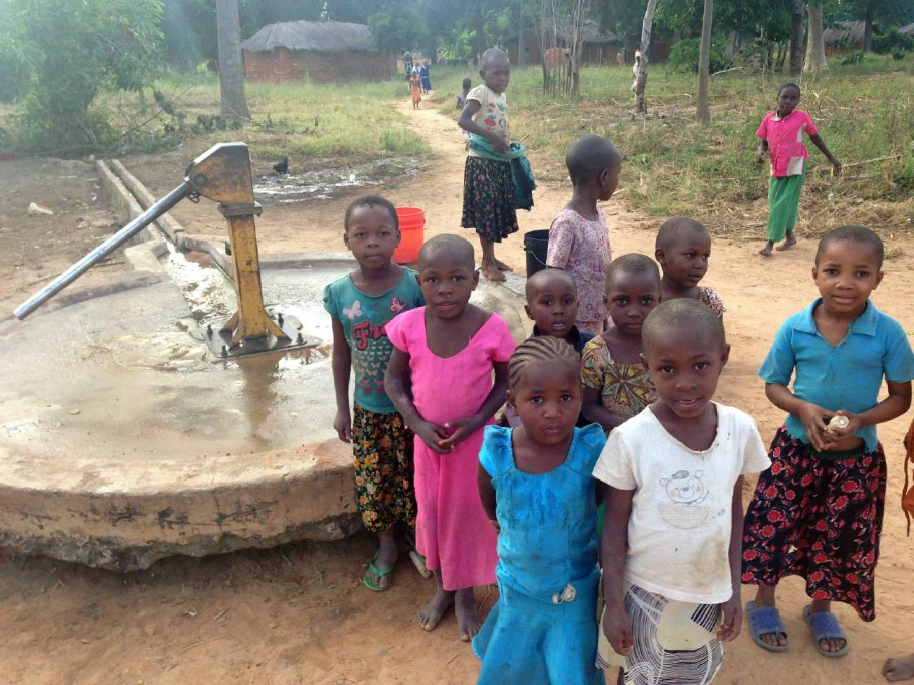

```{r setup, include=FALSE}
knitr::opts_chunk$set(echo = TRUE)
```

# Predicting Tanzania water pump maintenance



## The data

The case presented here is about water pumps in Tanzania. The data set originates from the Tanzanian Ministry of Water. Currently, this ministry maintains its pumps based on a maintenance schedule or, of course, when they break down. We feel that the maintenance of the Tanzanian water pumps could improve in both the cost of maintenance and the prevention of break downs by introducing machine learning to predict if a water pump is in need of repair or even the moment of failure of each water pump. 

## Objective

Our objective is to develop a reproducible model that can predict which pumps will fail in the future, either the moment or just whether they fail. The resulting model is to be used by the Tanzanian government to effectively maintain their water pumps.

Normally for this type of data you would expect that a single water pump was measured
over-time and using this data we could predict the need for repairs for a given pump. In this case however, at 
every practically every timepoint a different water point was measured! So we have to make some assumptions about the
data and the approach to how we create a model.

### Assumptions

**We should know in advance which water point should be predicted**, there must be something like a 
maintenance schedule at least 3 days ahead. We make this assumption because we have to able to take
into account the measured variables about the water pumps.!

**Measured variable should all be assumed to be known in advance**, otherwise we should choose
to leave out some variables that may have only become known at the time of determining the functioning of a water pump.
Variables like the `funder` and `district_code` are clearly known ahead of maintenance, but other variables like 
`water_quality` and `amount_tsh` (total amount water available to waterpoint) may not be known before determining the state of the pump.


### The surprise 

The water pump data is surprising in that it is not really a timeseries that you would
normally see in similar cases where the objective is to predict system failure using
sensor data over time. In the data we'll find a feature named `wpt_name`, short for waterpoint name, a name
that is intuitively unique for every water pump. However... When we look at the non-numerical
variables we see that many of the labels have a large number of unique values, as expected, but these also include `wpt_name`! 

